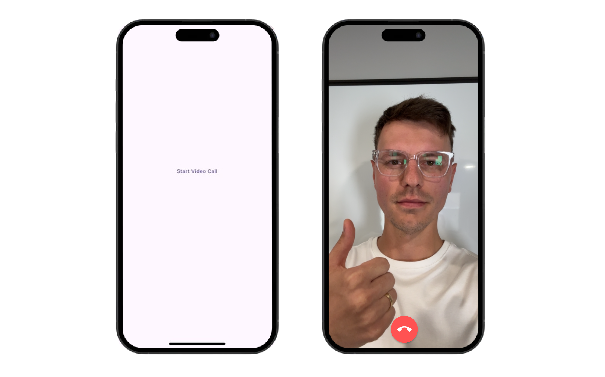

At least 50% of people use subtitles when watching shows or movies. Sometimes, it's hard to hear; other times, I like the option to be able to read. What if we bring that same feeling to your video calls? That's exactly what we will build in this guide.


## Prerequisites
1. Flutter
2. A developer account with [Agora](https://console.agora.io)
3. Backend Server to communicate with Agora's Real Time Transcription (Can use [this example server](https://github.com/tadaspetra/agora-server))

## Project Setup

This guide assumes you have a fundamental understanding of how a simple video call works using Agora. 

If you do not have a grasp on Agora Fundamentals, you can take a look at the [Flutter quickstart guide within the documentation](https://docs.agora.io/en/video-calling/get-started/get-started-sdk?platform=flutter) or you could dive deeper with the full [Video Call with Agora Flutter course](https://course-demo-two.vercel.app/flutter).

Our starting point for this guide will be a simple video call app built with Agora, which [you can find here](https://github.com/AgoraIO-Community/flutter_call_subtitles/tree/main/starter-app).

The starter code has a landing screen with only one button that invites you to join a call. This call happens on a single channel called `test` (it's a demo, okay). Within the call screen, you have the remote users' video, your local video, and an end-call button. We add and remove the users from the view using the event handlers.



## Speech to Text
Agora has a product called Real Time Transcription that you can enable to start transcribing the call of a specific channel.

Real-Time Transcription is a RESTful API that uses an AI microservice to connect to your call and transcribe the spoken audio. This transcription is streamed directly into your video call using the `onStreamMessage` event. Optionally, it can also be written to a cloud provider, which we will do in this guide.

### Backend

Real-Time Transcription should be implemented on your business server. With the backend controlling the microservices, you can ensure that only one instance of Real-Time Transcription runs within each channel. You also need to pass your token to the transcription service, so by doing it on the backend, you don't expose that token on the client side.

We will use [this server as our backend](https://github.com/tadaspetra/agora-server). This server exposes two endpoints: one for starting the transcription and another for ending it.

#### Start Real Time Transcription
```
/start-transcribing/<--Channel Name-->
```

#### Stop Real Time Transcription
```
/stop-transcribing/<--Channel Name-->/<--Task ID-->/<--Builder Token-->
```


## Start Transcription within the Call
You can use the' http' package to make a network call from your Flutter application. Ensure you use the same App ID on both the front-end app and the backend server to connect to the same Agora service. Then, call your API to start the transcribing. 

Within the [`call.dart`](./lib/call.dart) file, you can add this `startTranscription` function:

```dart
Future<void> startTranscription({required String channelName}) async {
  final response = await post(
    Uri.parse('$serverUrl/start-transcribing/$channelName'),
  );

  if (response.statusCode == 200) {
    print('Transcription Started');
    taskId = jsonDecode(response.body)['taskId'];
    builderToken = jsonDecode(response.body)['builderToken'];
  } else {
    print('Couldn\'t start the transcription : ${response.statusCode}');
  }
}
```

We will call this function right after our join call method so that it starts as soon as the first user joins the channel. As part of a successful response, you will receive a Task ID and a Builder Token. Save these because you will need to use them to stop the transcription.

When the transcription starts successfully, it behaves like a user in the channel. It's not a real user, though; it's a bot. The service has its own UID defined within your backend server. If you are using the [server I linked above](https://github.com/tadaspetra/agora-server), the UID is `101`. You can exclude this from the remote user's list in the `onUserJoined` event.

```dart
onUserJoined: (RtcConnection connection, int remoteUid, int elapsed) {
  if (remoteUid == 101) return;

  setState(() {
    _remoteUsers.add(remoteUid);
  });
}
```
## End Transcription
We use a function similar to the starting function to end the transcription. This function will be called `stopTranscription` and requires us to pass the Task ID and the Builder Token to stop the Real-Time Transcription service.

```dart
Future<void> stopTranscription() async {
  final response = await post(
    Uri.parse('$serverUrl/stop-transcribing/$taskId/$builderToken'),
  );
  if (response.statusCode == 200) {
    print('Transcription Stopped');
  } else {
    print('Couldn\'t stop the transcription : ${response.statusCode}');
  }
}
```

We will call the `stopTranscription` method in our call screen's `dispose` method. This will stop the transcription before we leave the channel and release the engine resource.

## Retrieve the Transcription
To access the transcription during the video call, use the `onStreamMessage` event in the event handler. 

```dart
onStreamMessage: (RtcConnection connection, int uid, int streamId,
    Uint8List message, int messageType, int messageSize) {
  print(message);
}
```

You will notice the code above prints out an array of numbers that only mean something to you if you are an all-knowing AI. These numbers are generated using [Google's Protocol Buffers](https://protobuf.dev) (also refered to as protobuf).

Protobufs encode data in a platform-agnostic way. This means that apps or software can retrieve and serialize this data according to their language.

## Decode the Transcription
We will use a Protocol Buffer to decode the message. In this case, we will serialize the random-looking numbers into an object called `Message`. 

Start by creating a `.proto` file with the following content: 

```
syntax = "proto3";

package call_summary;

message Message {
  int32 vendor = 1;
  int32 version = 2;
  int32 seqnum = 3;
  int32 uid = 4;
  int32 flag = 5;
  int64 time = 6;
  int32 lang = 7;
  int32 starttime = 8;
  int32 offtime = 9;
  repeated Word words = 10;
}
message Word {
  string text = 1;
  int32 start_ms = 2;
  int32 duration_ms = 3;
  bool is_final = 4;
  double confidence = 5;
}
```

Put this file in a new folder: `lib/protobuf/file.proto`. This is the input file for the generator to create our `Message` object. 

To use protobuf, you must install the protobuf compiler on your computer. It's available via package managers for Mac (`brew install protobuf`) and Linux (`apt install -y protobuf-compiler`). For Windows or if you need a specific version, check the [Prottobuf downloads page](https://protobuf.dev/downloads/).

You must also install the `protobuf` dart package within your project using `flutter pub add protobuf`.

Now run the following command in your terminal. Four files should be generated in the same `lib/protobuf` folder.

```
protoc --proto_path= --dart_out=. lib/protobuf/file.proto  
```

Now that the protobuf is set up, we can use the new `Message` object to retrieve our transcription in English. This object contains a `words` array with the transcribed sentences. The current sentence is concatenated every time a new word comes in, making it easy for us. We can also overwrite a variable `subtitle` with the most up-to-date `text`.

```dart
onStreamMessage: (RtcConnection connection, int uid, int streamId,
    Uint8List message, int messageType, int messageSize) {
  Message text = Message.fromBuffer(message);
  setState(() {
    subtitle = text.words[0].text;
  });
},
```

We create a String variable called `subtitle` and display it at the bottom of our screen. Whenever a new word is retrieved in the `onStreamMessage` callback, we will update that variable and trigger a rebuild to show the most up-to-date subtitles.

```dart
Padding(
  padding: const EdgeInsets.all(32.0),
  child: Center(
    child: Column(
      mainAxisAlignment: MainAxisAlignment.end,
      children: [
        Container(
          margin: const EdgeInsets.only(bottom: 10),
          padding: const EdgeInsets.all(10),
          decoration: BoxDecoration(
            borderRadius: BorderRadius.circular(8),
            color: Colors.white,
          ),
          child: Text(subtitle),
        ),
       //... End Call Button
      ],
    ),
  ),
),
```

## Run the App
With that, we have a fully working video call with subtitles. Run this app using `flutter run`, click the button to join the "test" channel, and you will see subtitles at the bottom of your screen as you speak.


## Done
With that, we have built an application that triggers a Real-Time Transcription service as soon as someone joins the channel. Now, you no longer have to worry about missing the words being spoken.


You can find the [complete code here](https://github.com/tadaspetra/agora/tree/main/call_summary). And dive into the [Real-Time Transcription documentation](https://docs-beta.agora.io/en/real-time-transcription/get-started#rest-api) to build upon this guide.

Thank you for reading!


